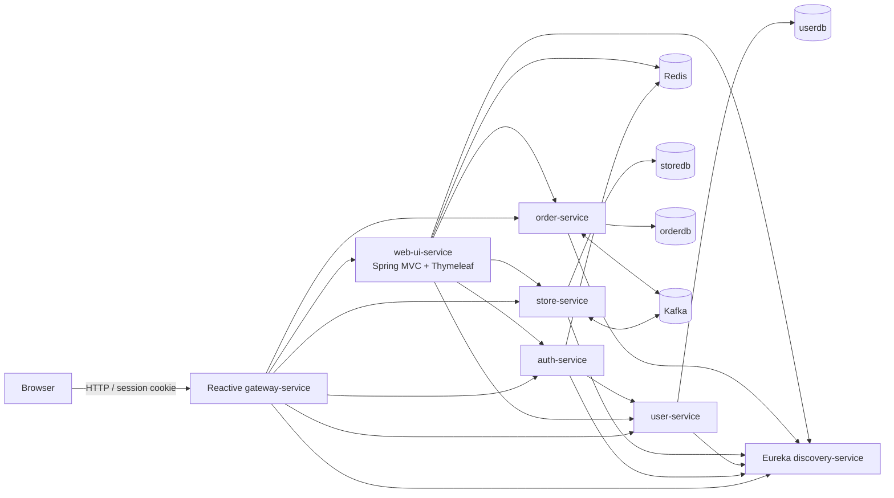
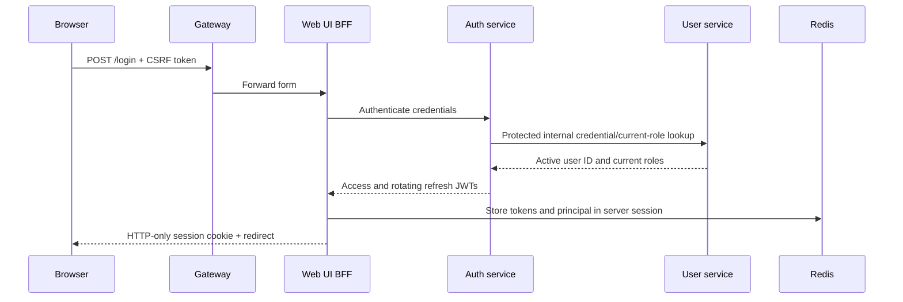
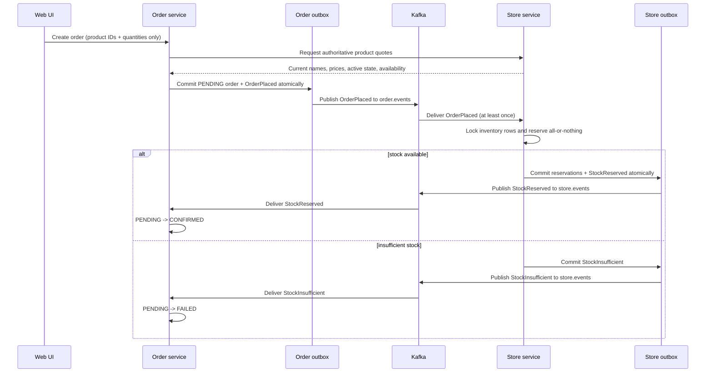

# Order Processing Platform

Order Processing Platform is a Java 21/Spring portfolio application that demonstrates a production-minded microservice order lifecycle with a server-rendered browser experience. Customers can authenticate, browse and search the catalog, manage a cart, check out, follow asynchronous order processing, view their own orders, and cancel eligible orders. Administrators can manage users, products, inventory, and orders.

The browser-facing application deliberately remains a backend-for-frontend (BFF): HTML is rendered by Spring MVC and Thymeleaf, while order processing, identity, inventory, and messaging remain independent backend services.

## Architecture



Only the gateway is the public application entry point. Service containers use the Compose network and Eureka for internal traffic; their application ports are exposed to other containers but are not bound to the host. This keeps browser traffic centralized and allows application services to be scaled without host-port collisions.

### Modules

| Module | Responsibility |
| --- | --- |
| `security-starter` | Shared servlet JWT validation, role mapping, revocation checks, and REST security responses |
| `kafka-common` | Shared event contracts, topic definitions, serializer configuration, retry, and dead-letter behavior |
| `user-service` | Users, profiles, password changes, roles, administrative lifecycle, and protected identity lookups |
| `auth-service` | Login, JWT access/refresh rotation, current-role refresh, logout, and token revocation |
| `store-service` | Product catalog, authoritative quotes, inventory, durable reservations, and stock-side saga processing |
| `order-service` | Order ownership, authoritative totals, state transitions, order outbox, and stock-result processing |
| `web-ui-service` | Spring MVC BFF, Redis-backed browser sessions, Thymeleaf pages, cart, checkout, profile, and admin UI |
| `gateway-service` | Reactive edge routing, JWT enforcement for APIs, UI routing, rate limiting, and forwarded headers |
| `discovery-service` | Eureka registry and discovery dashboard |

### Technology stack

- Java 21, Maven multi-module build
- Spring Boot 3.3 and Spring Cloud 2023
- Spring MVC, Thymeleaf, Layout Dialect, Spring Security, and Spring Session Redis
- HTMX for optional fragment updates; Bootstrap 5.3 and Bootstrap Icons via WebJars
- Spring Cloud Gateway (reactive) and Netflix Eureka
- PostgreSQL 16, Flyway, JPA/Hibernate
- Redis 7.2 for browser sessions, token state, and gateway rate limits
- Kafka with ZooKeeper for the order saga
- Spring Boot Actuator and Springdoc OpenAPI
- Docker Compose with clean-clone multi-stage image builds

## Request and security flows

### Browser request flow

1. The browser connects to `gateway-service` at `/`.
2. The gateway routes HTML, assets, and form posts to `web-ui-service`; API paths remain mapped to their owning service.
3. The BFF reads the authenticated principal and cart from the server-side Redis session.
4. The BFF calls backend services over the private Compose network and renders a complete HTML response.
5. Normal forms remain functional without JavaScript. HTMX requests may return a focused fragment for a faster update.

JWT access and refresh tokens stay in the server-side session. They are never written to URLs, HTML attributes, browser storage, or JavaScript. The browser receives only an HTTP-only session cookie. State-changing forms retain CSRF protection.

### Login flow



Refresh validates token type, JTI, token version, blacklist state, current account status, and current roles before rotating tokens. Logout requires an authenticated access token, revokes the relevant token state, invalidates the Redis session, and clears the browser cookie. API authorization is enforced at the gateway and again by each backend service.

## Order saga, outbox, and inventory concurrency



The create-order contract accepts product IDs and positive quantities only. `order-service` obtains current prices from `store-service`, calculates item totals and the order total, and commits the `PENDING` order with its `OrderPlaced` outbox row in one database transaction.

Outbox publishers claim bounded batches with database locking, publish using the order ID as the Kafka key, wait for broker acknowledgement, and only then mark a row published. Failed sends remain eligible for bounded retry and dead-letter handling. Consumers record event identity and Kafka position in durable inbox/processed-event tables, so an at-least-once redelivery cannot reserve, release, confirm, or fail twice.

Inventory reservations are durable rows keyed by order and product. The store locks inventory rows in deterministic product-ID order with pessimistic write locks, validates the complete batch, and changes quantities in a single transaction. Therefore a failed item rolls back the entire batch. Cancellation emits `OrderCancelled` through the order outbox; store-side processing locks the reservation rows and changes only `RESERVED` rows to `RELEASED`, making repeated cancellation delivery harmless.

The supported state transitions are:

- `PENDING -> CONFIRMED` after `StockReserved`
- `PENDING -> FAILED` after `StockInsufficient`
- `PENDING -> CANCELLED` for an eligible early cancellation
- `CONFIRMED -> CANCELLED` with inventory compensation

No client endpoint can assign an arbitrary status. Customer ownership comes from validated JWT claims; administrators use separately authorized operations.

## Why the UI is a separate service

`gateway-service` is built on Spring WebFlux and should stay focused on reactive edge concerns: routing, authentication, rate limits, and forwarded headers. Thymeleaf controllers, servlet security, form validation, CSRF, and Redis-backed `HttpSession` semantics belong naturally to Spring MVC. Keeping those concerns in `web-ui-service` avoids mixing incompatible web stacks and lets the gateway remain a small infrastructure component.

The BFF renders login and registration, dashboard, catalog search/pagination/detail, cart, checkout, pending/confirmed/failed order views, order history/detail/cancellation, profile/password forms, and administrator pages. Shared Thymeleaf layouts and fragments provide navigation, flash messages, pagination, status badges, form errors, empty states, and loading indicators. HTMX enhances selected interactions but is not required for correctness.

## Start from a clean clone

Prerequisites are Docker Desktop (or Docker Engine) with Docker Compose. Host-side Java and Maven are not required.

On Linux/macOS:

```bash
cp .env.example .env
docker compose up -d --build
docker compose ps
```

On PowerShell:

```powershell
Copy-Item .env.example .env
docker compose up -d --build
docker compose ps
```

Each service image uses the repository root as its build context. Its Maven build stage runs `mvn -pl <module> -am clean package -DskipTests`; the runtime stage contains only a Java 21 JRE, `curl` for health probes, and a non-root application user.

Compose starts one instance of every application service. PostgreSQL, Redis, ZooKeeper, Kafka, Eureka, and downstream services are gated by health conditions. The one-shot `database-init` service idempotently ensures `userdb`, `storedb`, and `orderdb` exist even when a PostgreSQL volume already exists. Each owning service then runs its own Flyway migrations against its own database.

To watch startup:

```bash
docker compose ps
docker compose logs --tail=200 -f discovery-service user-service auth-service store-service order-service web-ui-service gateway-service
```

Application containers use graceful Spring shutdown and a 40-second Compose stop grace period. Configuration or migration failures receive only three restart attempts, avoiding an endless local restart loop.

### Environment variables

`.env.example` contains explicitly labelled local-development values. Copy it; do not treat those values as production credentials.

| Variable | Purpose | Local default/example |
| --- | --- | --- |
| `SPRING_PROFILES_ACTIVE` | Enables local development data and behavior | `dev` |
| `DB_NAME` | Initial PostgreSQL database; init also ensures all three service databases | `userdb` |
| `DB_USERNAME` / `DB_PASSWORD` | PostgreSQL application credentials | local development values |
| `DB_PORT` | PostgreSQL host port | `5432` |
| `REDIS_PASSWORD` | Required Redis authentication shared by Redis clients | local development value |
| `REDIS_PORT` | Redis host port | `6379` |
| `KAFKA_PORT` / `ZOOKEEPER_PORT` | Host listener ports | `9092` / `2181` |
| `JWT_SECRET` | HMAC JWT signing key; use at least 64 random characters | local development value |
| `USER_SERVICE_INTERNAL_API_KEY` | Auth-to-user protected API key | local development value |
| `STORE_SERVICE_INTERNAL_API_KEY` | Order-to-store protected API key | local development value |
| `GATEWAY_SERVICE_PORT` | Public application/gateway port | `8080` |
| `DISCOVERY_SERVICE_PORT` | Eureka dashboard and discovery port | `8761` |
| `AUTH_SERVICE_PORT` | Auth container port | `8081` |
| `USER_SERVICE_PORT` | User container port | `8082` |
| `STORE_SERVICE_PORT` | Store container port | `8083` |
| `ORDER_SERVICE_PORT` | Order container port | `8084` |
| `WEB_UI_SERVICE_PORT` | BFF container port | `8085` |
| `SESSION_COOKIE_SECURE` | Require HTTPS for the browser session cookie | `false` locally; `true` behind HTTPS |
| `THYMELEAF_CACHE` | Cache templates | `false` locally |
| `REGISTRATION_ENABLED` | Show/accept customer self-registration | `true` locally |

Compose requires database, Redis, JWT, and internal API secrets rather than silently inventing them. For a non-development environment, use a secret manager, select a non-`dev` profile, enable secure cookies behind HTTPS, restrict infrastructure ports, and rotate every value copied from `.env.example`.

### Development users

The `dev` profile creates these users idempotently. They are not created by non-development profiles.

| Role | Username | Password |
| --- | --- | --- |
| Customer | `johndoe` | `Customer123!` |
| Administrator | `admin` | `Admin123!` |

The development catalog contains several products with varied availability, including an out-of-stock item, so both successful and insufficient-stock flows can be demonstrated.

### Demonstration walkthrough

For the customer path, sign in as `johndoe`, search or page through the catalog, open a product, add it to the cart, adjust quantity, and submit checkout. The detail page initially shows `PENDING`; refresh or its HTMX status fragment then observes `CONFIRMED`. The order appears under My Orders, and attempts to open an order owned by another customer are rejected.

To demonstrate insufficient stock, check out with more units than the displayed availability. The order moves from `PENDING` to `FAILED`, shows the stock reason, and leaves no partial reservation. To demonstrate compensation, cancel an eligible `PENDING` or `CONFIRMED` order; its durable reservation is released once even if the request or Kafka event is repeated.

For the administrator path, sign in as `admin`, open `/admin`, then manage the product catalog and inventory, filter all orders, and manage user activation and roles. Administrative controls are protected by backend authorization as well as conditional UI rendering.

## URLs

The defaults below assume `.env.example` was copied unchanged.

| Purpose | URL |
| --- | --- |
| Browser UI | <http://localhost:8080/> |
| Gateway base URL | <http://localhost:8080/> |
| Login | <http://localhost:8080/login> |
| Customer application | <http://localhost:8080/app> |
| Administrator application | <http://localhost:8080/admin> |
| Gateway health | <http://localhost:8080/actuator/health> |
| Eureka dashboard | <http://localhost:8761/> |
| Eureka health | <http://localhost:8761/actuator/health> |

Swagger UI and raw OpenAPI JSON are routed through the gateway's Eureka discovery routes:

| Service | Swagger UI | OpenAPI JSON |
| --- | --- | --- |
| Auth | <http://localhost:8080/auth-service/swagger-ui/index.html> | <http://localhost:8080/auth-service/v3/api-docs> |
| Users | <http://localhost:8080/user-service/swagger-ui/index.html> | <http://localhost:8080/user-service/v3/api-docs> |
| Store | <http://localhost:8080/store-service/swagger-ui/index.html> | <http://localhost:8080/store-service/v3/api-docs> |
| Orders | <http://localhost:8080/order-service/swagger-ui/index.html> | <http://localhost:8080/order-service/v3/api-docs> |

Backend health endpoints are intentionally not published as host ports. Compose probes these exact internal URLs:

- `http://auth-service:8081/actuator/health`
- `http://user-service:8082/actuator/health`
- `http://store-service:8083/actuator/health`
- `http://order-service:8084/actuator/health`
- `http://web-ui-service:8085/actuator/health`

For example:

```bash
docker compose exec auth-service curl -fsS http://localhost:8081/actuator/health
docker compose exec web-ui-service curl -fsS http://localhost:8085/actuator/health
```

Only health information is anonymous; other Actuator details remain protected or unexposed.

## Build, tests, and validation

With Maven 3.9+ and Java 21 installed locally:

```bash
mvn clean verify
mvn -pl user-service test
mvn -pl auth-service test
mvn -pl store-service test
mvn -pl order-service test
mvn -pl gateway-service test
mvn -pl web-ui-service test
```

Without host Maven, use the same builder image and repository mount, or rely on the clean-clone Docker builds:

```bash
docker compose --env-file .env.example config --quiet
docker compose build --no-cache
docker compose up -d
docker compose ps
docker compose logs --tail=200
```

Useful repository checks:

```bash
git diff --check
docker compose --env-file .env.example config --quiet
```

## Local scaling

There are no Swarm-only `deploy.replicas` declarations and scalable application services have neither `container_name` nor host port bindings. Compose therefore starts one replica by default and can scale a stateless service explicitly:

```bash
docker compose up -d --scale user-service=3
```

Eureka assigns unique instance IDs and the gateway load-balances discovered instances. Scale only after migrations are current and retain a single-instance Kafka replication configuration for this local demonstration.

## Troubleshooting

### A service remains `starting` or becomes `unhealthy`

Inspect the dependency first, then the application:

```bash
docker compose ps
docker compose logs --tail=200 postgres redis kafka discovery-service
docker compose logs --tail=200 <service-name>
docker inspect --format '{{json .State.Health}}' <container-id>
```

Typical causes are a host port collision, a missing required `.env` value, an old database volume with different credentials, or a failed Flyway migration.

### Compose reports a required variable is missing

Create `.env` from the example and rerun the command. Compose intentionally fails instead of falling back to fixed secrets:

```bash
cp .env.example .env
docker compose config --quiet
```

### PostgreSQL credentials changed after the volume was created

The official image applies `POSTGRES_USER` and `POSTGRES_PASSWORD` only when initializing a new data directory. Restore the old values, change the role inside PostgreSQL, or—only when local data can be discarded—remove the volumes and recreate them:

```bash
docker compose down -v
docker compose up -d --build
```

`down -v` permanently deletes local PostgreSQL and Redis data.

### Flyway validation fails

Never edit an applied migration. Restore the original migration, add a new versioned migration for the correction, and review the owning service log. To inspect history:

```bash
docker compose exec postgres sh -c 'psql --username="$POSTGRES_USER" --dbname=userdb --command="select * from flyway_schema_history order by installed_rank;"'
```

Repeat with `storedb` or `orderdb` for the other services.

### Kafka is not ready

Kafka waits for a healthy ZooKeeper and advertises `kafka:29092` internally plus `localhost:9092` to host tools. Check both services and confirm the port is free:

```bash
docker compose logs --tail=200 zookeeper kafka
docker compose exec kafka kafka-broker-api-versions --bootstrap-server localhost:29092
```

### Login succeeds but later requests redirect to login

Check Redis health and `web-ui-service` logs. The browser cookie stores only a session identifier; losing Redis data invalidates the session. Also confirm all token-validating services receive the same `JWT_SECRET` and that `SESSION_COOKIE_SECURE=false` is used only for local HTTP.

### UI/API route returns 404

Confirm the target appears in Eureka and is healthy. The explicit UI route must precede generic discovery routes; APIs remain under `/api/auth/**`, `/api/users/**`, `/api/store/**`, and `/api/orders/**`.

## Portfolio concepts demonstrated

This repository is intentionally backend-led. It demonstrates bounded microservices, service discovery, a reactive gateway, JWT authentication and revocation, internal API-key authentication, Redis-backed server sessions, SSR with Thymeleaf, progressive HTMX enhancement, a Kafka choreography saga, transactional outbox/inbox patterns, idempotent consumers, Flyway migrations, pessimistic concurrency control, authoritative server-side pricing, role and ownership authorization, health-aware orchestration, graceful shutdown, non-root container images, and clean-clone Docker builds.
