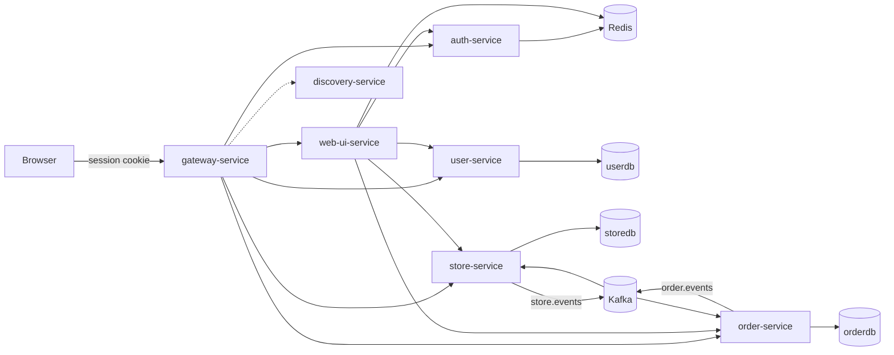
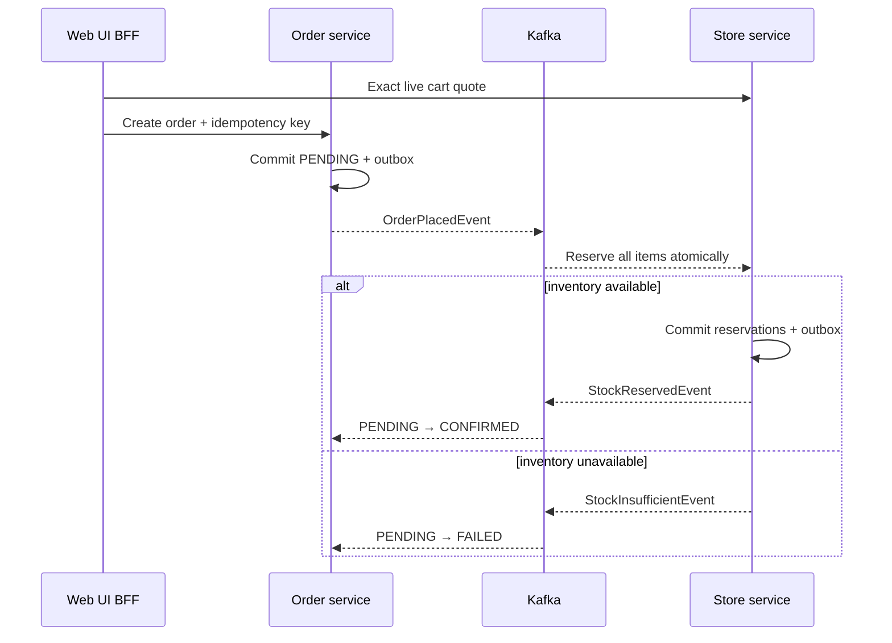

# Order/flow

Order/flow is a Java 21 and Spring Boot microservices showcase for a human-in-the-loop, event-driven order saga. A customer submits an order, inventory confirms it asynchronously, a warehouse operator packs it, a delivery operator ships and delivers it, and every handoff is visible in a live customer timeline and durable audit history.

The repository is designed to be evaluated from a clean clone. Docker Compose builds every service, creates the databases, applies Flyway migrations, seeds four demo personas and 15 realistic products, and waits for the complete platform to become healthy. Java and Maven are not required on the host.

## What you can demonstrate

- Human fulfillment flow: `PENDING → CONFIRMED → PACKAGED → SHIPPED → DELIVERED`
- Role-specific customer, warehouse, delivery, and administrator workspaces
- Kafka choreography with transactional outbox/inbox and idempotent consumers
- Strict pre-checkout validation against live price, product state, and exact stock quantity
- Cancellation only while an order is `PENDING` or `CONFIRMED`
- Inventory reservations that are released on cancellation/failure and consumed on delivery
- Immutable lifecycle history with actor, reason, correlation ID, event ID, and timestamps
- Bootstrap 5.3 server-rendered UI with HTMX updates and a persisted light/dark theme
- Optional Kafka event browser and Prometheus metrics through Compose profiles
- Health-gated startup, non-root application images, graceful shutdown, CI, and safe demo reset scripts

## Run it

### Prerequisites

- Docker Desktop, or Docker Engine with Docker Compose v2
- About 8 GB of memory available to Docker for the first parallel image build
- Ports `8080` and `8761` free; optional tools use `8090` and `9090`

### Fastest start

Linux/macOS:

```bash
sh scripts/start-demo.sh
```

Windows PowerShell:

```powershell
.\scripts\start-demo.ps1
```

Or use Compose directly:

```bash
docker compose --env-file .env.example up -d --build --wait --wait-timeout 360
```

Open <http://localhost:8080/login>. The first build can take several minutes; later builds reuse Docker layers.

### Demo accounts

These deterministic accounts exist only with the default `dev` profile.

| Persona | Username | Password | Starts at |
| --- | --- | --- | --- |
| Customer | `johndoe` | `Customer123!` | `/app` |
| Warehouse operator | `warehouse_worker` | `WarehouseDemo2026!` | `/admin/warehouse` |
| Delivery operator | `delivery_driver` | `DeliveryDemo2026!` | `/admin/delivery` |
| Administrator | `admin` | `Admin123!` | `/admin` |

These are local showcase credentials, not production defaults. Set `DEMO_MODE=false` to hide them from the login page, and never run a shared environment with the values in `.env.example`.

## Five-minute guided walkthrough

Use separate private browser windows for the personas, or sign out between steps.

1. Sign in as `johndoe`, open **Catalog**, add an in-stock product, review the cart, and check out. The BFF revalidates the exact cart against live store inventory immediately before creating the order.
2. Open the new order. It moves from `PENDING` to `CONFIRMED` after the Kafka inventory handshake. The status region continues polling while fulfillment is active and replaces itself completely on a terminal outcome.
3. Sign in as `warehouse_worker`. Open **Warehouse queue** and choose **Pack order**. The authoritative HTTP command commits `PACKAGED`, history, and an `OrderPackagedEvent` outbox row atomically.
4. Sign in as `delivery_driver`. Open **Delivery queue**, enter an optional tracking reference, choose **Mark shipped**, then **Mark delivered**. Delivery settles the reservation as `CONSUMED` and reduces on-hand stock exactly once.
5. Return to the customer order. The horizontal rail shows all five completed stages, the tracking reference, and the actor-aware activity history. The cancel control disappeared when fulfillment advanced beyond `CONFIRMED`.
6. Optionally sign in as `admin` to inspect all statuses, users, roles, products, inventory, and service readiness.

To see checkout protection, add more units than are live and available. Checkout remains blocked with an actionable availability message instead of creating a knowingly invalid saga. The seeded **Lumen Portable Bluetooth Speaker** has zero stock for this path.

## Architecture at a glance



Human actions are authenticated HTTP commands owned by `order-service`; Kafka carries past-tense facts after the state change is committed. This prevents broker access from becoming fulfillment authorization while retaining an event-driven integration boundary.

The inventory handshake is asynchronous:



For the full state machine, trust boundaries, retry/reconciliation behavior, and consistency guarantees, read [Architecture](docs/architecture.md). The message contracts are in [AsyncAPI](docs/asyncapi.yaml), and the command-versus-fact decision is recorded in [ADR-0001](docs/adr/0001-human-in-the-loop-fulfillment.md).

## Modules

| Module | Responsibility |
| --- | --- |
| `gateway-service` | Reactive edge routing, JWT enforcement, rate limits, correlation IDs, and forwarded headers |
| `web-ui-service` | Spring MVC BFF, Thymeleaf/HTMX UI, Redis session/cart, checkout guard, and role workspaces |
| `auth-service` | Login, access/refresh rotation, logout, and token revocation |
| `user-service` | Identities, account state, `USER`/`WAREHOUSE`/`DELIVERY`/`ADMIN` roles, and dev personas |
| `store-service` | Product catalog, authoritative quotes, inventory locking, durable reservations, and settlement |
| `order-service` | Order aggregate, lifecycle commands, history, reconciliation, and order outbox/inbox |
| `kafka-common` | Shared event contracts, registry, topics, serializers, retries, and Kafka dead-letter routing |
| `security-starter` | Shared servlet JWT and revocation enforcement |
| `discovery-service` | Eureka registry and dashboard |

## Seed catalog

The `dev` profile creates exactly 15 deterministic products: five electronics, five clothing items, and five home goods. Prices range from `$49.95` to `$249.99`, stock levels range from `0` to `85`, SKUs are unique, and descriptions are presentation-ready. Seeding is idempotent and profile-scoped; production profiles do not receive demo catalog rows.

Development seed changes use forward-only Flyway migrations plus the profile initializer. Previously applied migrations are intentionally not rewritten, so an existing clone can upgrade without a checksum failure.

## Optional inspection tools

Start the core platform plus Kafka UI and Prometheus:

```bash
docker compose --env-file .env.example --profile tools --profile observability up -d --build --wait --wait-timeout 360
```

| Tool | URL | Useful for |
| --- | --- | --- |
| Kafka UI | <http://localhost:8090> | Inspect `order.events`, `store.events`, and their DLTs |
| Prometheus | <http://localhost:9090> | Query JVM/HTTP metrics and `order_platform_*` lifecycle, reservation, outbox, and dead-letter gauges |
| Eureka | <http://localhost:8761> | Inspect registered service instances |

Optional tools bind to loopback and do not start in the default profile.

## API documentation

The gateway is the public application entry point.

| Service | Swagger UI | OpenAPI JSON |
| --- | --- | --- |
| Auth | <http://localhost:8080/auth-service/swagger-ui/index.html> | <http://localhost:8080/auth-service/v3/api-docs> |
| Users | <http://localhost:8080/user-service/swagger-ui/index.html> | <http://localhost:8080/user-service/v3/api-docs> |
| Store | <http://localhost:8080/store-service/swagger-ui/index.html> | <http://localhost:8080/store-service/v3/api-docs> |
| Orders | <http://localhost:8080/order-service/swagger-ui/index.html> | <http://localhost:8080/order-service/v3/api-docs> |

Application service and infrastructure ports are not published to the host. Eureka and optional inspection tools bind to loopback; the gateway is the only broadly bound application port.

## Operations

Check readiness and logs:

```bash
docker compose --env-file .env.example ps
docker compose --env-file .env.example logs --tail=200 -f gateway-service web-ui-service order-service store-service
curl --fail http://localhost:8080/actuator/health
```

Stop while keeping local data:

```bash
sh scripts/stop-demo.sh
```

```powershell
.\scripts\stop-demo.ps1
```

Reset all local database, Redis, and Prometheus volumes and recreate the demo:

```bash
sh scripts/reset-demo.sh --yes
```

```powershell
.\scripts\reset-demo.ps1 -Force
```

Reset is intentionally explicit because it permanently deletes local demo data.

## Configuration

`.env.example` contains local-development values and documents every required secret/port. The start scripts use it directly. To customize the environment, copy it to `.env`, change the values, and omit `--env-file .env.example` from Compose commands.

Important runtime switches:

| Variable | Default | Purpose |
| --- | --- | --- |
| `SPRING_PROFILES_ACTIVE` | `dev` | Enables demo identities and catalog |
| `DEMO_MODE` | `true` | Shows demo credentials on the sign-in page |
| `REGISTRATION_ENABLED` | `true` | Enables customer self-registration |
| `SESSION_COOKIE_SECURE` | `false` | Set `true` behind HTTPS |
| `ORDER_PENDING_TIMEOUT` | `PT10M` | Deadline before an unfinished inventory handshake is reconciled to `FAILED` |
| `ORDER_OUTBOX_MAX_ATTEMPTS` / `STORE_OUTBOX_MAX_ATTEMPTS` | `5` | Database outbox publish attempts before operator intervention |
| `ORDER_OUTBOX_RETENTION` / `STORE_OUTBOX_RETENTION` | `P30D` | Retention for successfully published outbox rows |

Outbox retries use exponential backoff with jitter and preserve order per aggregate. A dead-lettered outbox row deliberately blocks later facts for that order; unrelated orders continue. Kafka consumer failures use bounded retry and route exhausted records to the source topic's `.dlt`.

## Build and test

With Java 21 and Maven 3.9+:

```bash
mvn clean verify
```

Without local Java/Maven, the Dockerfiles support an opt-in test build:

```bash
docker compose --env-file .env.example build --build-arg "MAVEN_TEST_ARGS=" order-service store-service web-ui-service
```

Repository checks used by CI:

```bash
git diff --check
docker compose --env-file .env.example config --quiet
```

GitHub Actions runs the Java 21 reactor, validates Compose, builds the complete stack, waits for health, and smoke-tests the gateway and login page. Dependabot covers Maven, Docker, and workflow dependencies.

## Troubleshooting

### A container is unhealthy

```bash
docker compose --env-file .env.example ps
docker compose --env-file .env.example logs --tail=250 postgres redis kafka discovery-service
docker compose --env-file .env.example logs --tail=250 <service-name>
```

Typical causes are a port collision, insufficient Docker memory, or an old local volume created with different credentials.

### Database credentials changed after first startup

The PostgreSQL image applies its bootstrap credentials only when the volume is created. Restore the old values, or reset disposable demo data with the explicit reset script.

### Flyway validation fails

Do not edit an applied migration. Restore it and add a new versioned migration. The database owner logs identify the exact checksum or SQL error.

### Login redirects back to the sign-in page

Check `redis`, `auth-service`, and `web-ui-service`. Browser tokens are kept in the Redis-backed server session; clearing Redis intentionally expires active sessions. All token-validating services must share the same `JWT_SECRET`.

### Start from a completely clean Docker state

Run the reset script, then the start script. Do not use `down -v` if the volumes contain data you need.

## Repository policies

See [CONTRIBUTING.md](CONTRIBUTING.md) for the development workflow and [SECURITY.md](SECURITY.md) for responsible vulnerability reporting and production-hardening boundaries.
