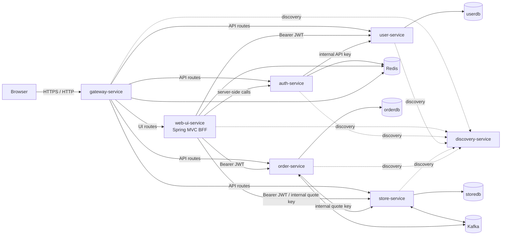
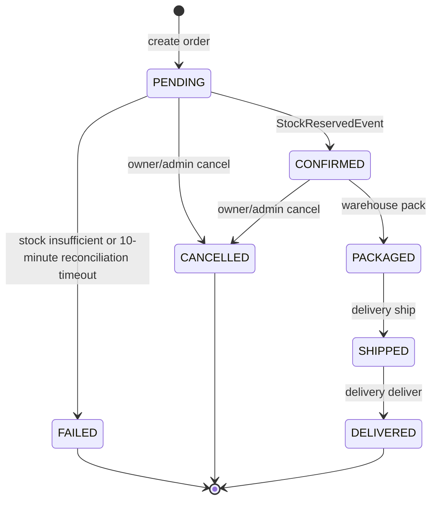

# Architecture and fulfillment semantics

This document describes the behavior implemented in this repository. It is a design map, not a promise of capabilities that do not yet exist. The Kafka wire contract is documented separately in [`asyncapi.yaml`](asyncapi.yaml), and the command/fact decision is recorded in [`ADR-0001`](adr/0001-human-in-the-loop-fulfillment.md).

## System context



| Component | Owned responsibility and state |
| --- | --- |
| `gateway-service` | Public routing, API JWT validation, token-revocation checks, correlation IDs, and Redis-backed rate limits |
| `web-ui-service` | Thymeleaf/HTMX backend-for-frontend, CSRF-protected forms, Redis-backed browser session and cart, and downstream API calls |
| `auth-service` | Login, access/refresh JWT issuance and rotation, logout, and revocation state |
| `user-service` | User identity, credentials, account state, roles, and authorities in `userdb` |
| `store-service` | Catalog, authoritative quotes, inventory totals, per-order reservations, store outbox/inbox in `storedb` |
| `order-service` | Order aggregate, state machine, immutable item price snapshots, transition history, order outbox/inbox in `orderdb` |
| `kafka-common` | Shared event classes, the event type allow-list, topic names, serializers, consumer retry, and Kafka DLT routing |
| `discovery-service` | Eureka registration and service discovery |

There is no distributed database transaction. Each service commits only its own state and uses HTTP or Kafka at an explicit boundary.

## Trust boundaries

1. **Browser to edge.** `gateway-service` is the public application entry point. In Compose, application-service ports are available only on the backend network; the gateway is the only application port bound publicly. Infrastructure ports are bound to loopback for local inspection.
2. **Browser session to BFF.** Access and refresh JWTs are stored in the server-side, Redis-backed HTTP session. The browser receives an HTTP-only session cookie, not the tokens. `web-ui-service` enforces its own route roles and CSRF protection on state-changing forms.
3. **Gateway to resource services.** API callers present an access JWT. The gateway validates it and checks Redis-backed revocation state; servlet resource services validate the JWT and revocation state again. The `roles` claim becomes `ROLE_*` authorities.
4. **Internal HTTP.** Auth-to-user credential/state calls require `USER_SERVICE_INTERNAL_API_KEY`. The authoritative store quote endpoint requires `STORE_SERVICE_INTERNAL_API_KEY`; it is called server-side by `order-service` and `web-ui-service`. These keys authenticate a calling service, not an end user, and must be replaced outside development.
5. **Kafka.** Kafka is a backend trust boundary. The Compose broker uses plaintext transport and events are not individually signed. Authorization for a human action therefore never comes from a Kafka producer; it is checked on the authenticated HTTP command before state changes. A production deployment must add broker authentication/ACLs and encrypted transport.
6. **Database ownership.** User, store, and order schemas are separate databases. No service reads another service's tables.

## Human-in-the-loop roles

| Role | Fulfillment capability |
| --- | --- |
| `ROLE_USER` | Create an order, view owned orders/history, and cancel an owned `PENDING` or `CONFIRMED` order |
| `ROLE_WAREHOUSE` | View the `CONFIRMED` fulfillment queue and execute `pack` |
| `ROLE_DELIVERY` | View `PACKAGED` and `SHIPPED` queues and execute `ship` or `deliver` |
| `ROLE_ADMIN` | Manage users, catalog/inventory, inspect all orders/history, and cancel an eligible order; it is intentionally not accepted as a warehouse or delivery role |

The dev profile seeds one persona for each role. Role checks exist in both the BFF and the owning backend; hiding a UI control is not the authorization mechanism.

## Commands are authoritative; Kafka carries facts

Human actions are synchronous, authenticated HTTP commands handled by `order-service`. The service locks the order, checks the exact current state, changes the aggregate, appends status history, and inserts the past-tense event into its outbox in one transaction.

| HTTP command | Required role | Accepted state | Committed result | Outbox fact |
| --- | --- | --- | --- | --- |
| `POST /api/orders` | Authenticated caller | New aggregate | `PENDING` | `OrderPlacedEvent` |
| `POST /api/orders/{id}/cancel` | Owner or `ROLE_ADMIN` | `PENDING` or `CONFIRMED` | `CANCELLED` | `OrderCancelledEvent` |
| `POST /api/orders/{id}/pack` | `ROLE_WAREHOUSE` | `CONFIRMED` | `PACKAGED` | `OrderPackagedEvent` |
| `POST /api/orders/{id}/ship` | `ROLE_DELIVERY` | `PACKAGED` | `SHIPPED` | `OrderShippedEvent` |
| `POST /api/orders/{id}/deliver` | `ROLE_DELIVERY` | `SHIPPED` | `DELIVERED` | `OrderDeliveredEvent` |

Pack, ship, and deliver are idempotent when the aggregate is already in the command's resulting state. A repeated ship with a different supplied tracking reference is an idempotency conflict. Any other current-state mismatch returns an order transition conflict rather than skipping a lifecycle step.

The order service also consumes its own packaged, shipped, and delivered events. That listener records inbox acknowledgement only. It does **not** apply the transition again and does not treat a Kafka record as authority to perform a human action.

## Order state machine



`PACKAGED`, `SHIPPED`, and `DELIVERED` cannot be cancelled. There is no endpoint that assigns an arbitrary status or skips a transition.

Each accepted transition appends an `order_status_history` row containing the source and destination status, event ID, actor ID when applicable, actor role/system label, reason, correlation ID, event time, and record time. The JPA entity is immutable and the application exposes creation and ordered reads only. Shipment tracking is stored on the order; it also appears in the shipment event and the human-readable shipment history reason.

## Checkout and reservation saga

```mermaid
sequenceDiagram
    actor Customer
    participant W as web-ui-service
    participant O as order-service
    participant S as store-service
    participant OO as order outbox
    participant K as Kafka
    participant SO as store outbox

    Customer->>W: Submit checkout
    W->>S: Exact live quote for cart snapshot
    S-->>W: Price, active state, requested and available quantity
    W->>O: CreateOrderRequest + Idempotency-Key
    O->>S: Re-quote product IDs and exact quantities
    S-->>O: Authoritative quote
    O->>OO: Commit PENDING + history + OrderPlacedEvent
    OO->>K: order.events (key = orderId)
    K->>S: OrderPlacedEvent
    S->>S: Lock all inventory rows; validate whole order
    alt every item is active and available
        S->>SO: Commit RESERVED rows + StockReservedEvent
        SO->>K: store.events (key = orderId)
        K->>O: StockReservedEvent
        O->>O: Commit PENDING -> CONFIRMED + history
    else any item is unavailable
        S->>SO: Commit StockInsufficientEvent
        SO->>K: store.events (key = orderId)
        K->>O: StockInsufficientEvent
        O->>O: Commit PENDING -> FAILED + reason + history
    end
```

The BFF's pre-checkout quote prevents a stale cart from being submitted and must match the cart snapshot exactly. It is an early user-facing validation, not a reservation. `order-service` quotes again and owns the price snapshot and total used in the order. The actual all-or-nothing inventory decision happens asynchronously when `store-service` consumes `OrderPlacedEvent`.

Create-order idempotency is scoped by `(userId, Idempotency-Key)`. A PostgreSQL transaction advisory lock serializes concurrent use of the same key, and a partial unique index prevents duplicate persisted orders. The key is optional for API callers; the BFF supplies one for checkout.

## Inventory lifecycle

`inventory.quantity` is total on-hand stock and `inventory.reserved_quantity` is the portion held by active orders. Availability is `quantity - reserved_quantity`.

| Reservation state | Inventory effect | Terminal timestamp |
| --- | --- | --- |
| `RESERVED` | Increase `reserved_quantity`; leave total `quantity` unchanged | Neither set |
| `RELEASED` | On cancellation or timed-out saga compensation, decrease `reserved_quantity`; leave total `quantity` unchanged | `released_at` |
| `CONSUMED` | On delivery, decrease both `quantity` and `reserved_quantity` by the reserved amount | `consumed_at` |

Reservation rows are unique by `(order_id, product_id)`. Store processing locks reservation and inventory rows in deterministic product-ID order, checks invariants, and updates the inbox, inventory, reservations, and any outgoing store event in the same database transaction.

`CONSUMED` is deliberately distinct from deletion or release: it records that a delivered order permanently settled the stock. A late or duplicate cancellation changes only `RESERVED` rows, so it cannot restore already-consumed inventory. A duplicate delivery likewise finds no active reservation to consume.

## Transactional outbox and consumer inbox

### Outbox publication

Both order and store services write an event row in the same local transaction as their aggregate change. A scheduled publisher:

1. claims a bounded ready batch with `FOR UPDATE SKIP LOCKED`;
2. prevents a later event for the same aggregate from overtaking any earlier unpublished event, including one requiring dead-letter intervention;
3. deserializes only types present in `KafkaEventRegistry`;
4. publishes with the aggregate/order ID as Kafka key, using `acks=all` and an idempotent Kafka producer;
5. waits for the broker acknowledgement before marking the row published.

A crash after Kafka acknowledges but before the database marks the row may publish a duplicate. This is expected at-least-once behavior; consumers must remain idempotent.

Publisher failures increment `attempt_count` and set `next_attempt_at` using exponential backoff, capped at 60 seconds, with deterministic ±20% jitter. The default limit is five attempts, after which the database row is marked `dead_lettered`. That row intentionally blocks later facts for the same aggregate so lifecycle order cannot silently corrupt; unrelated aggregates continue publishing. This database outbox flag is different from a Kafka `.dlt` topic. There is currently no automatic replay or operator endpoint for database-dead-lettered outbox rows.

Published outbox rows and processed inbox rows are retained for 30 days by default and then removed by scheduled maintenance. Dead-lettered outbox rows are never removed automatically. The retention windows are configurable and must remain longer than the broker replay window used by an environment.

### Inbox/idempotency

Order and store consumers insert into their local `processed_kafka_events` table before applying work, in the same transaction as that work. The primary key is `event_id`, with a second uniqueness constraint on `(topic, partition, offset)`. A duplicate insert is a no-op and the handler returns without changing domain state. If an incoming event has a null ID, the consumer derives one from its Kafka position.

Because the inbox insert shares the transaction, a handler exception rolls back both the inbox marker and partial domain work, allowing a safe retry. Pessimistic row locks protect concurrent order transitions and inventory changes; the order aggregate also has an optimistic version column.

## Topics and event ownership

| Topic | Current producer | Current interested consumers | Current event types |
| --- | --- | --- | --- |
| `order.events` | `order-service` outbox | `store-service`; `order-service` observes fulfillment facts | `OrderPlacedEvent`, `OrderCancelledEvent`, `OrderFailedEvent`, `OrderPackagedEvent`, `OrderShippedEvent`, `OrderDeliveredEvent` |
| `store.events` | `store-service` outbox | `order-service` | `StockReservedEvent`, `StockInsufficientEvent` |
| `order.events.dlt` | Kafka error recoverer | No in-repository listener | Poison/exhausted records originating on `order.events` |
| `store.events.dlt` | Kafka error recoverer | No in-repository listener | Poison/exhausted records originating on `store.events` |

`OrderFailedEvent` is emitted only by pending-order reconciliation so `store-service` can release a reservation whose stock result never completed the saga. `OrderConfirmedEvent` remains in `KafkaEventRegistry` as a deserializable compatibility contract but is not emitted or consumed by the current saga.

The Kafka consumer error handler retries a failed record three times at one-second intervals after its initial delivery, then republishes the original record to `<source-topic>.dlt` on the same partition. No application listener automatically replays either DLT.

## Failure paths and recovery boundaries

| Failure | Implemented behavior |
| --- | --- |
| Live store quote unavailable or malformed | Checkout/create is rejected; no order is committed |
| Product inactive, missing, or short of stock during reservation | Store emits `StockInsufficientEvent`; order becomes `FAILED` with a safe reason |
| Duplicate Kafka delivery | Inbox uniqueness makes domain handling a no-op |
| Wrong role | BFF/backend authorization rejects the command; backend enforcement is authoritative |
| Correct role, wrong order state | Command returns HTTP `409` and makes no change |
| Cancellation after fulfillment starts | Returns HTTP `409`; no compensation event is emitted |
| Kafka consumer handler repeatedly fails | Original record plus three retries, then source-topic DLT |
| Outbox publish repeatedly fails | Database outbox row is marked `dead_lettered` at the configured attempt limit |
| Process dies after broker acknowledgement | Outbox may republish; downstream inbox absorbs the duplicate |
| Inventory handshake never completes | After 10 minutes by default, reconciliation commits `FAILED`, records history, and emits `OrderFailedEvent` so active reservations are released |
| Delivery fact commits but stock settlement repeatedly fails | Order remains `DELIVERED`; store processing retries and can land in `order.events.dlt`, requiring operator repair |

The platform implements a bounded deadline for the initial inventory handshake, but it does not include an outbox/DLT replay console or a DLT consumer. A dead-lettered first outbox row blocks later facts for that order until an operator repairs it, and an exhausted delivery-settlement record can leave inventory unsettled. These are explicit operational follow-ups rather than hidden exactly-once claims.

## Contract evolution rules

- `eventId` is the durable idempotency key and must remain stable across outbox retries.
- `correlationId` is propagated from the originating request through related facts where available.
- `schemaVersion` describes payload evolution. Current cancellation and fulfillment facts are emitted as version 2; the other active facts use version 1.
- Fulfillment metadata fields are nullable in Java so legacy version-one payloads containing only `orderId` can still deserialize. New consumers must tolerate absent optional metadata.
- Event class simple names are persistence and deserialization identifiers in the outbox allow-list; renaming one requires an explicit compatibility migration/alias.
- Additive fields are preferred. A breaking field or semantic change requires a new schema version and a compatibility plan for stored outbox rows and records already in Kafka.
