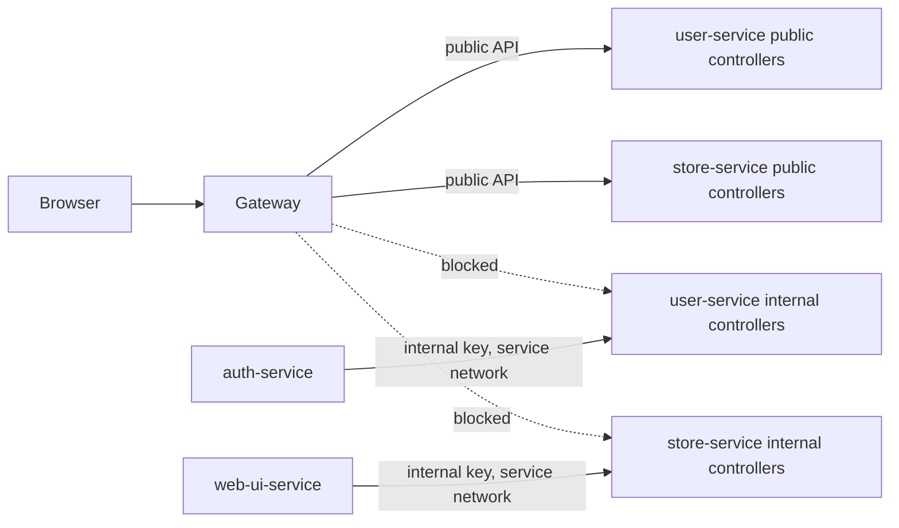
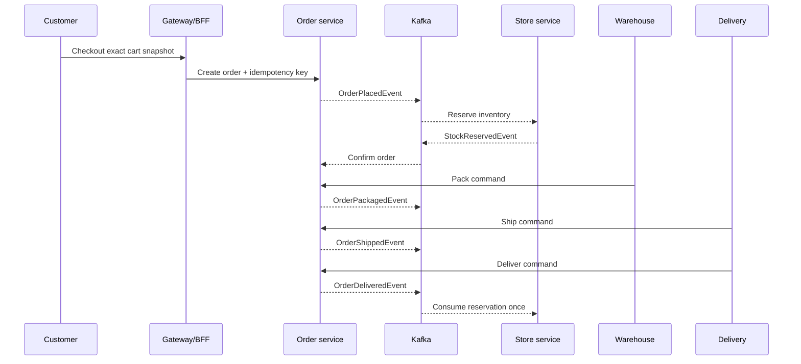

# Evidence-First Showcase Hardening Design

**Status:** Approved
**Date:** 2026-08-16
**Audience:** Backend and distributed-systems hiring managers
**License decision:** MIT

## Context

Order/flow already demonstrates a human-in-the-loop order saga, transactional outbox/inbox processing, role-scoped fulfillment commands, inventory reservations, compensation, lifecycle history, and a Docker Compose demo. The next improvement should make those claims independently verifiable while closing the most visible trust-boundary and operational gaps.

The repository will use an evidence-first strategy. Correctness and recoverability will be demonstrated before adding broader platform complexity. Each issue will be implemented, verified, and committed independently with a short Conventional Commit message under the repository's configured Mahan Fatehian identity.

## Goals

- Ensure CI runs for the repository's current default branch.
- Prevent public gateway traffic from reaching service-to-service internal APIs or injecting internal credentials.
- Detect new secrets before they enter Git history.
- Execute the complete customer-to-delivery saga against the real Compose stack in CI.
- Provide explicit, authorized, audited recovery for dead-lettered outbox rows and Kafka DLT records.
- Make the multi-persona demo easier to follow without weakening authentication.
- Give reviewers immediate visual and documentary evidence of the system's behavior.
- Publish the repository under the MIT license.

## Non-goals

- No Kubernetes, service mesh, workflow engine, CQRS split, event sourcing, or additional microservice.
- No claim of end-to-end exactly-once delivery. The system continues to rely on at-least-once delivery plus idempotent processing.
- No automatic, bulk, or timer-driven dead-letter replay.
- No Git history rewrite or force-push. Previously committed development configuration remains a repository-owner decision; credentials must be rotated if they were reused elsewhere.
- No Spring platform upgrade, asymmetric JWT migration, or OpenTelemetry rollout in this change set. Those deserve isolated follow-up work.

## Change Set and Commit Boundaries

### 1. Default-branch CI coverage

**Commit:** `ci: cover the default branch`

The CI push trigger will cover both `master` and `main`. Supporting both names fixes the current mismatch while allowing a later default-branch rename without silently disabling push validation. Pull-request and manual triggers remain unchanged.

Acceptance criteria:

- Pushes to `master` and `main` trigger CI.
- Pull requests and manual dispatch continue to work.
- The workflow remains least-privileged and passes syntax validation.

### 2. Secret scanning

**Commit:** `security: add secret scanning`

A pinned Gitleaks workflow will scan pull requests, pushes, and manual runs. Configuration will allow known deterministic demo values only where narrowly required and will not create broad repository-wide exclusions. Contributor and security documentation will explain how to respond to a finding.

This protects future history; it does not erase old commits. No secret values from historical files will be copied into issues, logs, documentation, or commit messages.

Acceptance criteria:

- A synthetic secret fixture is detected by a local/configuration test without committing the fixture.
- Documented demo credentials do not make normal CI unusable.
- The action and any downloaded tooling are version-pinned.

### 3. Public-edge trust boundary

**Commit:** `fix(gateway): block internal APIs`

The gateway will explicitly deny `/api/users/internal/**` and `/api/store/internal/**` before general service routes are considered. It will also remove both `X-Internal-Api-Key` and `X-Store-Internal-Api-Key` globally from all inbound public requests. The BFF and auth service continue to call internal service addresses directly and attach their configured credentials there; those calls do not pass through the public gateway.

The denial will use the gateway's standard JSON error envelope and correlation ID. Tests will exercise the real WebFlux security chain and routing behavior rather than only inspecting annotations.

Acceptance criteria:

- Anonymous and authenticated callers cannot reach either internal route through port `8080`.
- A client-supplied internal credential header is never forwarded.
- Existing UI, public API, Swagger, health, and service-to-service calls remain functional.

### 4. Full Saga acceptance evidence

**Commit:** `test: exercise the full saga`

A committed black-box acceptance runner will drive the real gateway and Compose services. It will authenticate each demo persona through normal endpoints, select deterministic seeded inventory, create an order with an idempotency key, and poll boundedly for each asynchronous transition.

The scenario is:

The runner will assert:

- `PENDING -> CONFIRMED -> PACKAGED -> SHIPPED -> DELIVERED` history exists in order.
- Unauthorized personas cannot invoke fulfillment commands.
- Repeating the create request with the same key does not create another order.
- Repeating fulfillment requests is conflict-safe and does not duplicate transitions.
- Delivery consumes the reservation and reduces inventory once in the end-to-end scenario.
- Correlation and event identifiers appear in lifecycle evidence.

The black-box flow proves the command and end-to-end state path; it does not by itself prove Kafka redelivery behavior. A separate real Kafka/PostgreSQL integration scenario will publish the same durable `OrderDeliveredEvent` identity more than once and verify that inbox deduplication consumes inventory only once.

CI will use deadlines and diagnostic polling rather than fixed blind sleeps. On failure it will capture the scenario output, service state, and bounded logs, then always tear down volumes.

Acceptance criteria:

- The scenario passes from a clean clone using `.env.example`.
- The scenario is part of the Compose CI job, not an optional local-only script.
- Failures identify the last observed state and relevant order ID.

### 5. Controlled dead-letter recovery

**Commit:** `feat(ops): add dead-letter recovery`

Recovery remains owned by the service that owns the failed work. `order-service` and `store-service` will expose administrator-only recovery commands and corresponding application services. No new operations service will be introduced. Generic source-topic republishing is explicitly forbidden because Saga state may have advanced or compensated after the failure.

#### Database outbox recovery

An administrator can request retry of one dead-lettered outbox event by event ID and provide a reason. The service will:

1. lock the event and its aggregate's publish head;
2. verify that it is dead-lettered and is the earliest unpublished event for that aggregate;
3. retain the original event ID, aggregate ID, type, payload, correlation ID, and ordering position;
4. increment a recovery generation and grant that generation a fresh bounded retry budget while retaining cumulative attempt history;
5. make it eligible for the existing publisher without publishing inside the HTTP request;
6. append actor, reason, previous attempt count, generation, timestamp, and the immediate `REQUEUED` outcome to the recovery audit.

The asynchronous publisher will append the eventual `PUBLISHED` or `DEAD_LETTERED` outcome for the same recovery generation. It will not overwrite the request audit or reset cumulative attempt evidence. Concurrent or stale requests return a conflict and never skip an earlier aggregate event.

#### Kafka DLT ownership and recovery

The current shared `<source-topic>.dlt` naming does not identify which consumer failed when more than one consumer group reads a topic. Dead-letter publication will therefore route to a consumer-owned destination such as `order.events.store-service.dlt` or `order.events.order-service.dlt`. The owning service accepts only its configured DLT topics and validates the recorded source topic, consumer group, event type, key, partition, and offset.

An administrator can request resolution of exactly one consumer-owned DLT record by topic, partition, and offset, with a required reason and one of two explicit dispositions:

- `REPLAY` is available only for allow-listed event types with a durable payload `eventId` and an event-specific state guard.
- `ACKNOWLEDGE_SUPERSEDED` records that a compensated or obsolete fact must not be replayed; the immutable Kafka record remains in the DLT and the resolution is represented by an append-only audit row.

Before `REPLAY`, the service will fetch the exact record, deserialize only an allow-listed event contract, and evaluate the owning service's durable domain guard. Safety will also be enforced when the replayed event is consumed, in the same local transaction as its domain mutation; it will not depend on a remote preflight check that can become stale.

For `OrderPlacedEvent`, `store-service` will maintain a per-order inventory lifecycle guard. `OrderFailedEvent` and `OrderCancelledEvent` will write a terminal tombstone even when no reservation exists. Placement and compensation handlers will lock that same guard row. If replayed placement commits first, a racing compensation subsequently releases its reservation. If compensation commits first, replayed placement observes the terminal tombstone and cannot reserve inventory. The original aggregate key is preserved. This makes both race orderings safe without a cross-service time-of-check/time-of-use window. A missing compensation tombstone caused by a separately dead-lettered compensation fact must be repaired first through its owning outbox/DLT recovery path.

Stock responses and fulfillment facts receive equivalent event-specific guards for their valid source and target states. Events for which both interleavings cannot be made safe are not replayable and can only receive a documented manual-remediation or superseded disposition.

Records without a durable payload `eventId` are not replayable. This prevents legacy offset-derived synthetic identities from changing when a new source offset is assigned and bypassing inbox deduplication. Such records require documented domain-specific manual remediation or a superseded disposition.

A replay preserves the original payload event ID, correlation ID, aggregate key, and typed payload. It regenerates only the allow-listed Spring type header needed by the current serializer; arbitrary Kafka DLT, exception, and transport headers are never copied back to the source topic. A unique recovery claim for the DLT coordinate prevents concurrent or repeated republishing. The normal inbox remains a second idempotency boundary, not the sole safety check.

Recovery APIs will be unavailable to customer, warehouse, and delivery roles. Requests and asynchronous outcomes will be observable in structured logs and metrics. The README/runbook will state when replay is safe, how to inspect the underlying cause first, how to resolve superseded facts, and how aggregate ordering affects later events.

Acceptance criteria:

- Automatic replay is impossible.
- Only `ROLE_ADMIN` can request recovery.
- One request targets one exact outbox event or DLT coordinate and requires a reason.
- Duplicate and concurrent recovery requests are idempotent or conflict-safe.
- Legacy DLT records without durable event identity are rejected.
- Both placement-before-compensation and compensation-before-placement races are tested; compensated placement cannot recreate a reservation.
- Tests prove consumer ownership, current-state guards, payload identity, header reconstruction, retry generations, aggregate ordering, and audit preservation against real Kafka and PostgreSQL.

### 6. Guided multi-persona demo

**Commit:** `feat(ui): guide the demo`

When `DEMO_MODE=true`, the login page will offer accessible persona selectors that populate the existing username and password fields; submission still uses the normal login flow. Role workspaces will show a compact next-step guide so a reviewer knows which persona acts next.

Order activity details will provide an expandable technical view containing correlation and event identifiers. Polling errors will become visible with a reconnect/retry state instead of leaving the last lifecycle view silently frozen. These additions will use the existing Bootstrap/Thymeleaf/HTMX design system and remain hidden or neutral when demo mode is disabled.

Acceptance criteria:

- Demo helpers never bypass authentication and are absent when demo mode is disabled.
- Keyboard and screen-reader users can select personas and understand polling state.
- Identifiers wrap safely on narrow screens and can be copied.
- Existing role authorization remains enforced server-side.

### 7. Showcase documentation and evidence

**Commit:** `docs: add showcase evidence`

The README will lead with a compact proof section containing local, deterministic screenshots of the customer timeline and fulfillment queues plus a short recorded lifecycle demonstration. Assets will be stored in the repository with descriptive filenames and alt text. The current clean-clone instructions remain the canonical startup path.

Documentation will connect visible behavior to implementation evidence: command-versus-fact ownership, transactional outbox/inbox, idempotency, compensation, ordering, and controlled recovery. It will also remove misleading duplication and link directly to the acceptance runner and recovery runbook.

Acceptance criteria:

- GitHub renders every image, Mermaid diagram, and relative link correctly.
- The first screen of the README explains what the project proves and how to run it.
- A stranger can start the stack and complete the guided flow without reading source code.
- Screenshots contain only deterministic demo data and no local secrets.

### 8. MIT license

**Commit:** `docs: add project license`

Add the standard MIT license with copyright attribution to Mahan Fatehian and link it from the README.

Acceptance criteria:

- The license text is standard and unmodified except for year and copyright holder.
- README repository policy information links to `LICENSE`.

## Error Handling and Safety

- Public-edge denials use stable status codes, error codes, and correlation IDs.
- Acceptance polling has per-state and overall deadlines; it never waits forever.
- Recovery validates state before mutation and returns conflict for stale requests.
- Recovery republishes existing facts; it never invents a replacement event identity.
- Existing unrelated worktree changes, if any appear, will not be included in commits.
- No destructive Docker reset is run against user data without explicit scope; CI uses disposable volumes.
- No history rewriting, branch renaming, remote push, or credential rotation is included.

## Verification Strategy

Every commit receives focused tests before commit. The final series receives:

1. Java 21 reactor verification with `mvn clean verify`.
2. Compose model validation using `.env.example`.
3. Clean-volume Compose startup with health gates.
4. The complete Saga acceptance scenario.
5. Gateway trust-boundary checks plus real Kafka/PostgreSQL recovery scenarios, including concurrent claims and both placement/compensation interleavings.
6. Secret-scanner configuration validation.
7. README link and asset review, including narrow-screen and keyboard checks for changed UI.
8. `git diff --check`, clean working-tree confirmation, and commit-author inspection.

If a verification step exposes an unrelated pre-existing failure, it will be reported separately rather than hidden or folded into an unrelated commit.

## Deferred Follow-ups

After this series, the strongest next candidates are a Spring Boot/Cloud support-line upgrade, payload-aware create-order idempotency fingerprints, transaction-boundary reductions around remote calls and Kafka acknowledgements, asymmetric JWT/JWKS signing, contract linting, and tracing. Each should be proposed and implemented as its own reviewable change set.
